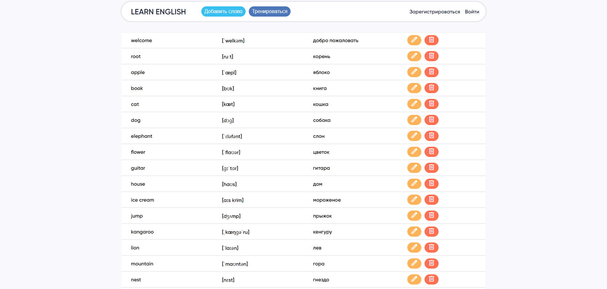

# Foreign Languages

## Description

A SPA for eanglish learning. Consists of:

- Editable word reference
- Training mode 
- Addition form
- 404 error page 

### Editable word reference

Shows the word transcription and translation in a list with the ability to edit and delete on each line

### Training mode

Сontains switchable cards for checking and remembering translations

### Addition form

Allows you to add and edit words. Validates entered values

### 404 error page

Is provided to return to the main page if the user enters an incorrect address in the address bar

## Technical details

✅ This website uses HTML, CSS and React.js including Flex for a responsive and functional interface, React context to create a single store of data and methods.

✅ To add, edit and delete words, api and asynchronous requests to it are used.

✅ The website is hosted on GitHub pages for easier demonstration.

---

🔗 Find this website on GitHub Pages:
https://olgalosikova.github.io/foreign-languages/
